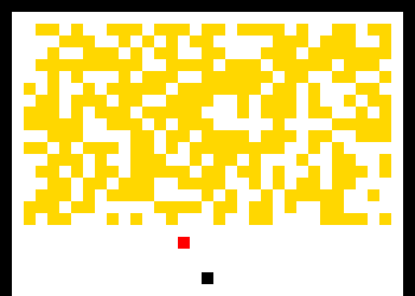

# Day 13: Care Package
Today we got fun stuff to do again... at least in my oppinion. :smile: We had to build a Bouncy Ball game (except for that we didn't really build it). The coding pat was done, so the only job was to put all parts together. First part was pretty straight forward and didn't have any visual parts to it, just drawing the game field and counted the blocks. Allthough the second part didn't requiere any visualization, I thought it would be cool to draw each frame as an image and make a small video of it. I actually tried to play the gam emy self first, but I quickly realized that I need to build an AI to play that crap game for me :smile: So it did and on the bottom of the README I've included an [image of the initial state](#images) again and the link to the video how my AI mastered the game.

### Personal Stats for the Day
**Part 1**

 Time                  | Rank | Score 
-----------------------|------|-------
 09:20:44              | 6195 | 0     

**Part 2**

 Time                  | Rank | Score 
-----------------------|------|-------
 11:09:51              | 4628 | 0   

## Part 1
#### Assignment
As you ponder the solitude of space and the ever-increasing three-hour roundtrip for messages between you and Earth, you notice that the Space Mail Indicator Light is blinking. To help keep you sane, the Elves have sent you a care package.

It's a new game for the ship's [arcade cabinet](https://en.wikipedia.org/wiki/Arcade_cabinet)! Unfortunately, the arcade is **all the way** on the other end of the ship. Surely, it won't be hard to build your own - the care package even comes with schematics.

The arcade cabinet runs [Intcode](https://adventofcode.com/2019/day/9) software like the game the Elves sent (your puzzle input). It has a primitive screen capable of drawing square tiles on a grid. The software draws tiles to the screen with output instructions: every three output instructions specify the `x` position (distance from the left), `y` position (distance from the top), and `tile id`. The `tile id` is interpreted as follows:

- `0` is an **empty** tile. No game object appears in this tile.
- `1` is a **wall** tile. Walls are indestructible barriers.
- `2` is a **block** tile. Blocks can be broken by the ball.
- `3` is a **horizontal paddle** tile. The paddle is indestructible.
- `4` is a **ball** tile. The ball moves diagonally and bounces off objects.

For example, a sequence of output values like `1,2,3,6,5,4` would draw a **horizontal paddle** tile (`1` tile from the left and `2` tiles from the top) and a **ball** tile (`6` tiles from the left and `5` tiles from the top).

Start the game. **How many block tiles are on the screen when the game exits?**

Your puzzle answer was `309`.

## Part 2
#### Assignment
The game didn't run because you didn't put in any quarters. Unfortunately, you did not bring any quarters. Memory address `0` represents the number of quarters that have been inserted; set it to `2` to play for free.

The arcade cabinet has a [joystick](https://en.wikipedia.org/wiki/Joystick) that can move left and right. The software reads the position of the joystick with input instructions:

- If the joystick is in the **neutral position**, provide `0`.
- If the joystick is **tilted to the left**, provide `-1`.
- If the joystick is **tilted to the right**, provide `1`.

The arcade cabinet also has a [segment display](https://en.wikipedia.org/wiki/Display_device#Segment_displays) capable of showing a single number that represents the player's current score. When three output instructions specify `X=-1, Y=0`, the third output instruction is not a tile; the value instead specifies the new score to show in the segment display. For example, a sequence of output values like `-1,0,12345` would show `12345` as the player's current score.

Beat the game by breaking all the blocks. **What is your score after the last block is broken?**

Your puzzle answer was `15410`.

## Images

#### Initial state of the game

#### AI playing the game for me

Link to YouTube video will be added as soon as I got the video published.