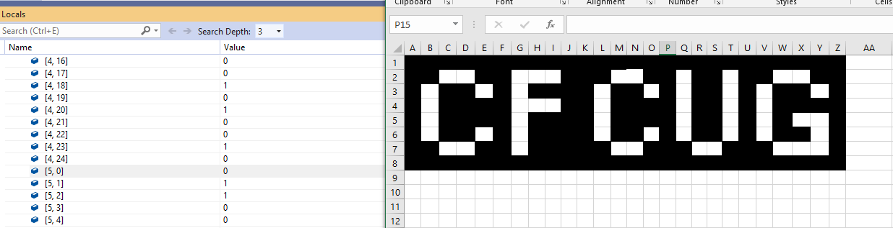
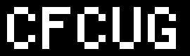

# Day 8: Space Image Format
Today we built an image decoder, a very simple one of course. First you check that your data isn't corrupted and then you start decoding. In the deconding part for today I toke 2 approaches to create the actuall image after decoding magic was done. First I just read the values from the array of valus and manually typed in all the black pixels into a grid canvas in Excel that I created. The second approache was the better and automatic one. I draw the (image[https://github.com/jooni91/advent-of-code-2019/tree/master/src/Solutions/Day8#images]) in code and saved the bitmap as image to an file. I included images of both approaches on the bottom of this readme.

### Personal Stats for the Day
**Part 1**

 Time                  | Rank | Score 
-----------------------|------|-------
 06:08:45              | 7632 | 0     

**Part 2**

 Time                  | Rank | Score 
-----------------------|------|-------
 06:38:05              | 7091 | 0   

## Part 1
#### Assignment
The Elves' spirits are lifted when they realize you have an opportunity to reboot one of their Mars rovers, and so they are curious if you would spend a brief sojourn on Mars. You land your ship near the rover.

When you reach the rover, you discover that it's already in the process of rebooting! It's just waiting for someone to enter a [BIOS](https://en.wikipedia.org/wiki/BIOS) password. The Elf responsible for the rover takes a picture of the password (your puzzle input) and sends it to you via the Digital Sending Network.

Unfortunately, images sent via the Digital Sending Network aren't encoded with any normal encoding; instead, they're encoded in a special Space Image Format. None of the Elves seem to remember why this is the case. They send you the instructions to decode it.

Images are sent as a series of digits that each represent the color of a single pixel. The digits fill each row of the image left-to-right, then move downward to the next row, filling rows top-to-bottom until every pixel of the image is filled.

Each image actually consists of a series of identically-sized **layers** that are filled in this way. So, the first digit corresponds to the top-left pixel of the first layer, the second digit corresponds to the pixel to the right of that on the same layer, and so on until the last digit, which corresponds to the bottom-right pixel of the last layer.

For example, given an image `3` pixels wide and `2` pixels tall, the image data `123456789012` corresponds to the following image layers:

    Layer 1: 123
             456

    Layer 2: 789
             012

The image you received is **`25` pixels wide and `6` pixels tall.**

To make sure the image wasn't corrupted during transmission, the Elves would like you to find the layer that contains the fewest `0` digits. On that layer, what is **the number of `1` digits multiplied by the number of `2` digits?**

Your puzzle answer was `2032`.

## Part 2
#### Assignment
Now you're ready to decode the image. The image is rendered by stacking the layers and aligning the pixels with the same positions in each layer. The digits indicate the color of the corresponding pixel: `0` is black, `1` is white, and `2` is transparent.

The layers are rendered with the first layer in front and the last layer in back. So, if a given position has a transparent pixel in the first and second layers, a black pixel in the third layer, and a white pixel in the fourth layer, the final image would have a **black** pixel at that position.

For example, given an image `2` pixels wide and `2` pixels tall, the image data `0222112222120000` corresponds to the following image layers:

    Layer 1: 02
             22

    Layer 2: 11
             22

    Layer 3: 22
             12

    Layer 4: 00
             00

Then, the full image can be found by determining the top visible pixel in each position:

- The top-left pixel is **black** because the top layer is `0`.
- The top-right pixel is **white** because the top layer is `2` (transparent), but the second layer is `1`.
- The bottom-left pixel is **white** because the top two layers are `2`, but the third layer is `1`.
- The bottom-right pixel is **black** because the only visible pixel in that position is `0` (from layer 4).

So, the final image looks like this:

    01
    10

**What message is produced after decoding your image?**

Your puzzle answer was `CFCUG`.

## Images
#### Manually typing result into Excel

#### Automatically generated image

